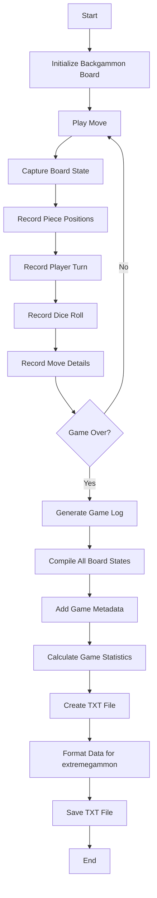

# Board-Gammon
Software to feed a fantastic backgammon board

## Flow of the System

```mermaid
graph TD
    A[Start] --> B[Initialize Backgammon Board]
    B --> C[Play Move]
    C --> D[Capture Board State]
    D --> D1[Record Piece Positions]
    D1 --> D2[Record Player Turn]
    D2 --> D3[Record Dice Roll]
    D3 --> D4[Record Move Details]
    D4 --> E{Game Over?}
    E -->|No| C
    E -->|Yes| F[Generate Game Log]
    F --> F1[Compile All Board States]
    F1 --> F2[Add Game Metadata]
    F2 --> F3[Calculate Game Statistics]
    F3 --> G[Create TXT File]
    G --> H[Format Data for extremegammon]
    H --> I[Save TXT File]
    I --> J[End]
```
